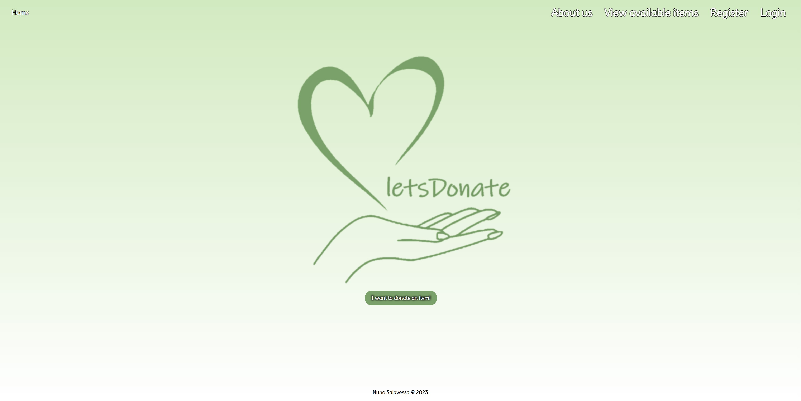
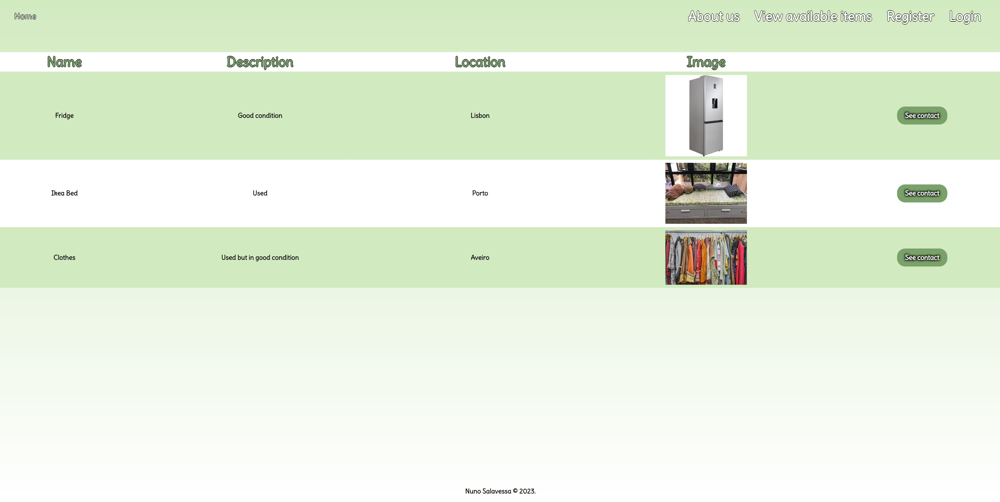
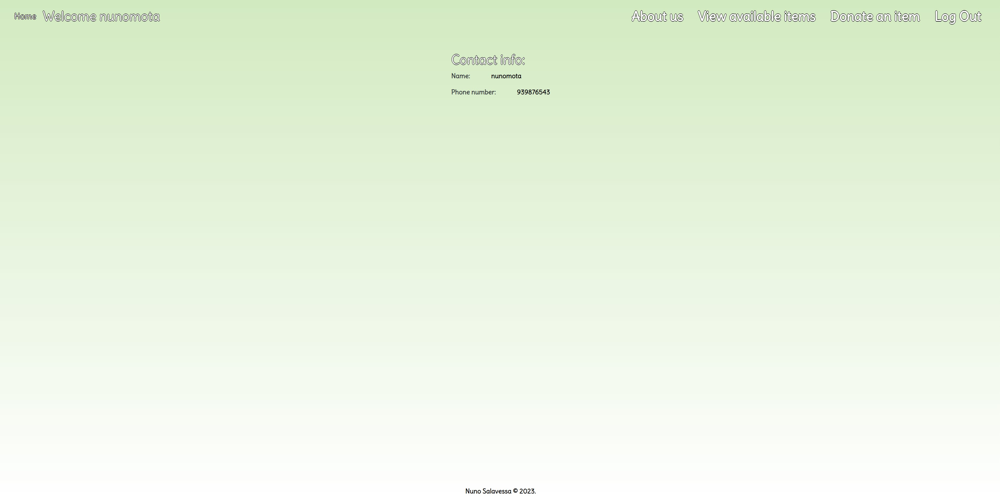
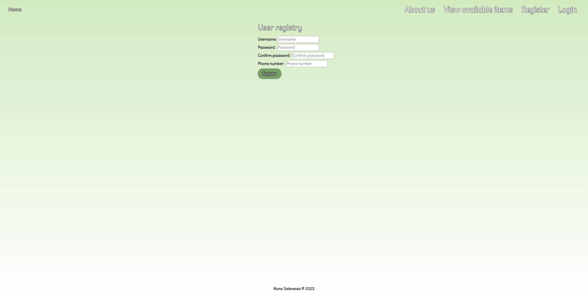
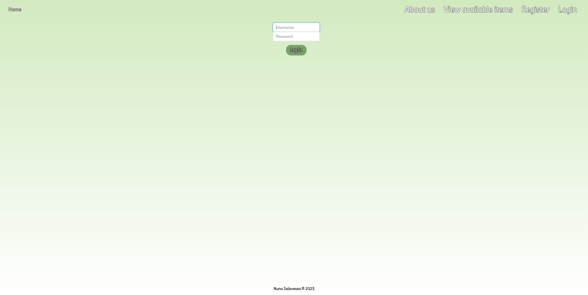

# Table of Contents

- [letsDonate](#letsdonate)
- [About the Project](#about-the-project)
- [Features](#features)
- [Technologies Used](#technologies-used)
- [Screenshots](#screenshots)
- [Getting Started](#getting-started)
  - [Prerequisites](#prerequisites)
  - [Installation](#installation)
- [Reporting Bugs](#reporting-bugs)
- [Suggesting Enhancements](#suggesting-enhancements)
- [Making a Pull Request](#making-a-pull-request)
- [Contact](#contact)

# letsDonate


Don’t waste, donate!

## About the Project

letsDonate is a platform designed to give your unused items a second life by donating them to those in need. Before you decide to throw away items, consider the possibility of making a difference in someone's life by donating them through letsDonate.

### Features

- **User Registration:** Users can register by providing a username, contact, and password.
- **Login/Logout:** Users can log in and out of their accounts.
- **Add Items for Donation:** Registered users can add items for donation by providing item details and images.
- **View Available Items:** All users can view the items available for donation.
- **Delete Items:** Registered users can delete items they have posted.
- **View Contact Information:** Registered users can view the contact information of donors.

### Technologies Used

- **Backend:** Python with Flask
- **Database:** SQLite
- **Frontend:** HTML, CSS, JavaScript, Bootstrap
- **Template Engine:** Jinja

### Screenshots








## Getting Started

These instructions will get you a copy of the project up and running on your local machine for development and testing purposes.

### Prerequisites

- Python
- Flask

### Installation

1. Clone the repo
   ```sh
   git clone https://github.com/SalavessaMota/letsDonate.git

   pip install -r requirements.txt

   python app.py
   ```

### Reporting Bugs

- Open a new issue to report a bug.

### Suggesting Enhancements

- If you have ideas for new features or improvements, open an issue to suggest them.

### Making a Pull Request

1. Fork the repo.
2. Create a new branch (`git checkout -b new-feature`).
3. Commit your changes (`git commit -am 'Add new feature'`).
4. Push to the branch (`git push origin new-feature`).
5. Create a new Pull Request.

Before making a pull request, please make sure your code follows the coding standards and that all tests pass.

## Contact

Nuno Salavessa Mota - [My Linkedin](https://www.linkedin.com/in/nunosalavessamota/) - nunosalavessa@hotmail.com

Project Link: [https://github.com/SalavessaMota/letsDonate](https://github.com/SalavessaMota/letsDonate)
